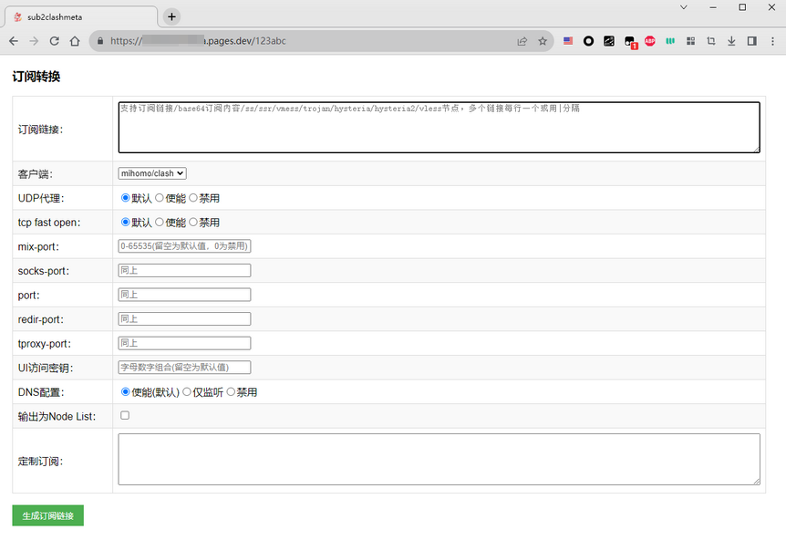
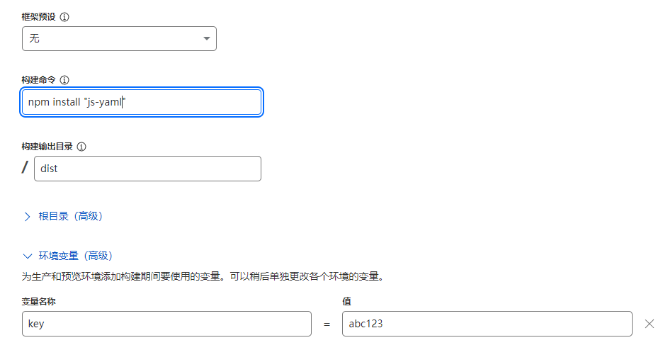

# sub2clashmeta
- 纯javascript实现的Clash Meta(mihomo)订阅转换器，搭建在免费的cloudflare pages上，而不需要另外购买vps。
- 支持解析订阅链接、base64节点信息、ss/ssr/vmess/trojan/vless/hysteria/hysteria2节点，并输出YAML配置文件。
- 自带一个前端页面，可以输入订阅链接进行转换，并对端口、UI、节点udp使能等进行配置。

### 在线体验
- 👉[sub2clashmeta](https://sub2clashmeta.pages.dev/123abc)
- 👉[sub2clashmeta](https://sub2clashmeta.v6.navy/123abc)



## 使用方式
### 方法一：从本地用wrangler部署
- 在本地电脑安装上nodejs，使用命令`npm install -g wrangler`安装好wrangler
- 将本仓库的dist目录、package.json、wrangler.toml下载到一个目录中(假定目录名为xxx)
- 进入xxx目录，在终端中执行以下命令：
```
npm install
npm run dev  (或  wrangler pages dev)
```
- 根据指示访问`http://127.0.0.1:8788`应该可以看到nginx页面，访问`http://127.0.0.1:8788/123456`即可看到订阅转换页面(123456是默认的key，key不匹配会显示为nginx错误页不能使用订阅功能，可以防止其他人随意访问你的网站服务，可以在`dist/_worker.js`中修改变量`key_default`以改变默认key，或者是部署后在`设置>变量和机密`上添加一个变量key来覆盖)，推荐输入订阅链接测试下在本地的转换功能是否正常
- 测试无误后执行`npm run deploy`或`wrangler pages deploy`部署到cloudflare上(可能提示要登陆cloudflare)
### 方法二：从github部署
- fork本项目，然后在cloudflare上新建一个pages项目，选择连接到git，然后选中刚fork好的项目
- 在第二步中按照如下填写(环境变量key可以不填，这里填了似乎不起作用，后续可以在部署完成后在`变量和机密`下再添加)



- 待部署完成后访问`https://<yourpages>.pages.dev/<key>`测试，其中`<key>`就是刚设置的环境变量key，如果没有设置就是默认的`123456`


## 其他说明
- 项目采用固定的YAML配置模板(dist/config.js)，部署前用户可以按照自己的需求修改里面的规则
- 订阅转换后的链接响应头可以带流量信息和过期时间(如果原订阅链接响应头中含有这些信息)，如果多个订阅链接都带该信息，则转换后会合并流量信息，过期时间返回其中最长的
- 转换器会对节点进行去重处理(server和port都相同认为是重复)，对重名的节点进行重命名处理
- 网页logo取自已不复存在的“狐搜搜”网盘搜索引擎
- 订阅链接里的节点数量最好不要太多，不然有可能超过cloudflare免费计划的10ms CPU时间限制，导致转换失败
- 以下是收集的一些免费节点订阅供测试，转换完大概是5k多个节点
```
https://raw.githubusercontent.com/Pawdroid/Free-servers/refs/heads/main/sub
https://raw.githubusercontent.com/peasoft/NoMoreWalls/master/list_raw.txt
https://raw.githubusercontent.com/ermaozi/get_subscribe/main/subscribe/v2ray.txt
https://raw.githubusercontent.com/aiboboxx/v2rayfree/main/v2
https://raw.githubusercontent.com/mfuu/v2ray/master/v2ray
https://raw.githubusercontent.com/mahdibland/SSAggregator/master/sub/airport_sub_merge.txt
https://raw.githubusercontent.com/mahdibland/SSAggregator/master/sub/sub_merge.txt
```

## 参考
- [SubConv](https://github.com/SubConv/SubConv)
- [sublink-worker](https://github.com/7Sageer/sublink-worker)
- [subconverter](https://github.com/tindy2013/subconverter)
